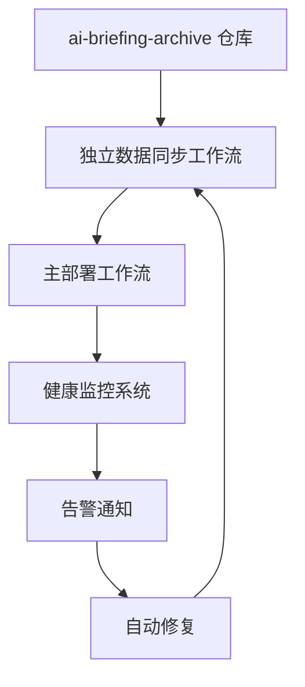

# AIHeadline.news 可靠数据同步解决方案

> **注意**：自 2025-09-26 起，仓库在 CI/CD 中通过 `.github/scripts/update-source-news.sh` 直接浅克隆 `ai-briefing-archive` 数据源，以下内容同步更新为新方案记录。


## 问题背景

AIHeadline.news 一直存在数据同步问题：

1. **子模块处于 detached HEAD 状态**：导致 `git submodule update --remote` 失效
2. **同步机制不可靠**：单一故障点，缺乏错误恢复机制
3. **缺乏监控**：无法及时发现数据过期或同步失败
4. **手动介入困难**：问题发生时需要复杂的手动修复流程

## 解决方案架构

### 🏗️ 三层防护架构



### 📋 核心组件

#### 1. 独立数据同步工作流 (`sync-news-data.yml`)

**特性：**
- ⏰ 每2小时自动检查更新
- 🔄 智能重试机制（最多5次）
- 🚨 冲突解决和错误恢复
- 📊 详细的同步状态报告
- 🎯 可被外部 webhook 触发

**触发方式：**
```bash
# 手动触发
gh workflow run sync-news-data.yml

# 强制同步（即使没有变化）
gh workflow run sync-news-data.yml --field force_sync=true
```

#### 2. 可靠同步机制 (`.github/scripts/update-source-news.sh`)

**解决方案：**
- 🧹 **一次性浅克隆**：每次构建直接拉取 `main` 最新快照，杜绝子模块残留。
- 🔄 **指数退避重试**：默认 3～4 次尝试即可穿透偶发网络抖动。
- ✅ **快照验证**：生成 `.source-news-meta` 并在日志中输出 commit 与时间戳。
- 🧼 **自动修整**：检测到历史子模块结构会先清理再克隆，保证目录干净可用。

**关键改进：**
```bash
# CI 与本地一致的调用方式，可按需覆盖环境变量
SOURCE_NEWS_FETCH_RETRIES=4 \
./.github/scripts/update-source-news.sh
```

#### 3. 健康监控系统 (`.github/actions/health-check`)

**监控指标：**
- 📅 数据新鲜度（默认6小时告警阈值）
- 📁 数据目录完整性与可读性
- 🌐 远程仓库连接性
- 📦 `.source-news-meta` 快照校验

**告警渠道：**
- 📱 Telegram 通知
- 🔔 GitHub Issues 自动创建
- 📈 状态徽章更新

#### 4. 紧急修复脚本（预留）

> 计划提供 `.github/scripts/emergency-fix.sh` 封装彻底清理与重新拉取逻辑，目前请使用下文方法手动操作。
## 🚀 立即修复当前问题

### 方法1：运行更新脚本（推荐）

```bash
# 1. 进入项目目录
cd /Users/yvan/developer/ai-briefing/AIHeadline.news

# 2. 直接刷新数据仓库
./.github/scripts/update-source-news.sh

# 3. 查看元信息（可选）
cat .source-news-meta
```

### 方法2：手动清理后重新拉取

```bash
# 1. 完全移除旧目录（包括可能残留的 .git 文件）
rm -rf source-news

# 2. 重新下载最新数据
./.github/scripts/update-source-news.sh

# 3. 如需提交配置更新
git add .gitignore .github/scripts/update-source-news.sh
git commit -m "chore: refresh source-news sync pipeline"
git push origin main
```

### 方法3：触发新的同步工作流

```bash
# 提交新的工作流文件后触发
gh workflow run sync-news-data.yml --field force_sync=true
```

## 📈 部署新方案的步骤

### Phase 1: 立即修复 (5分钟)
1. ✅ 运行更新脚本刷新 `source-news`
2. ✅ 验证数据更新
3. ✅ 触发网站重新构建

### Phase 2: 部署监控 (今天完成)
1. ✅ 提交健康监控工作流
2. ⚙️ 配置 Telegram 通知 (可选)
3. 🔧 启用定时健康检查

### Phase 3: 完整迁移 (本周完成)
1. 📋 测试新同步工作流
2. 🔄 替换主工作流的同步机制
3. 📊 监控运行效果

## 🛡️ 防护机制

### 自动修复触发条件
- 数据超过12小时未更新 → 触发紧急同步
- 连续同步失败 → 创建 GitHub Issue
- 健康检查失败 → 发送告警通知

### 故障恢复策略
1. **主同步失败** → 自动使用备用同步方法
2. **新方法失败** → 回退到原有机制
3. **完全失败** → 创建告警和 Issue

### 监控和告警
- **实时监控**：每小时健康检查
- **主动告警**：Telegram/GitHub Issues
- **状态展示**：README 状态徽章

## 📞 紧急联系

如果自动修复失败，请按以下步骤操作：

1. **检查工作流状态**：[GitHub Actions](https://github.com/Joe-oss9527/AIHeadline.news/actions)
2. **查看最新日志**：定位具体失败原因
3. **手动触发同步**：`gh workflow run sync-news-data.yml`
4. **检查权限设置**：确保 GitHub Token 有写权限

## 🔮 未来改进

- [ ] 实现 Webhook 触发机制
- [ ] 添加性能指标监控
- [ ] 集成更多通知渠道
- [ ] 实现数据备份和恢复
- [ ] 支持多环境部署

---

**最后更新**: 2024-09-24
**状态**: 🟢 准备就绪
**维护人**: AI Briefing Team
