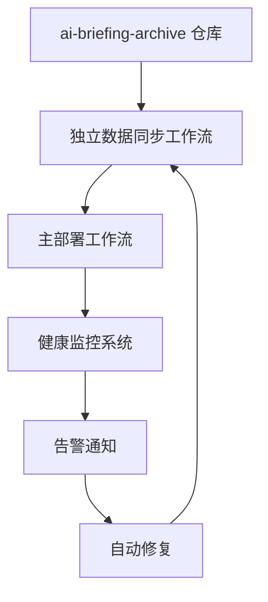

# AIHeadline.news 可靠数据同步解决方案

> **注意**：自 2025-09-24 起，仓库使用精简版 `deploy.yml` 工作流与 `.github/scripts/update-source-news.sh`，本文件仅作为历史记录。


## 问题背景

AIHeadline.news 一直存在数据同步问题：

1. **子模块处于 detached HEAD 状态**：导致 `git submodule update --remote` 失效
2. **同步机制不可靠**：单一故障点，缺乏错误恢复机制
3. **缺乏监控**：无法及时发现数据过期或同步失败
4. **手动介入困难**：问题发生时需要复杂的手动修复流程

## 解决方案架构

### 🏗️ 三层防护架构



### 📋 核心组件

#### 1. 独立数据同步工作流 (`sync-news-data.yml`)

**特性：**
- ⏰ 每2小时自动检查更新
- 🔄 智能重试机制（最多5次）
- 🚨 冲突解决和错误恢复
- 📊 详细的同步状态报告
- 🎯 可被外部 webhook 触发

**触发方式：**
```bash
# 手动触发
gh workflow run sync-news-data.yml

# 强制同步（即使没有变化）
gh workflow run sync-news-data.yml --field force_sync=true
```

#### 2. 可靠同步机制 (`.github/actions/reliable-sync`)

**解决方案：**
- 🧹 **完全重建子模块**：避免 detached HEAD 问题
- 🔄 **多次重试**：网络问题自动恢复
- ✅ **严格验证**：确保同步结果正确
- 🔧 **自动清理**：失败时自动回滚

**关键改进：**
```yaml
# 彻底解决 detached HEAD 问题
- 删除现有子模块目录
- 清理 .git/modules 缓存
- 重新添加并初始化子模块
- 确保检出到 main 分支
```

#### 3. 健康监控系统 (`.github/actions/health-check`)

**监控指标：**
- 📅 数据新鲜度（默认6小时告警阈值）
- 🔍 子模块状态检查
- 🌐 远程仓库连接性
- 📁 内容文件完整性

**告警渠道：**
- 📱 Telegram 通知
- 🔔 GitHub Issues 自动创建
- 📈 状态徽章更新

#### 4. 紧急修复脚本 (`.github/scripts/emergency-fix.sh`)

**立即可用的修复方案：**
```bash
cd /path/to/AIHeadline.news
./.github/scripts/emergency-fix.sh
```

**功能：**
- 🔧 一键修复子模块问题
- 📊 详细的状态检查和报告
- 💾 安全的变更提交
- ✅ 修复结果验证

## 🚀 立即修复当前问题

### 方法1：运行紧急修复脚本

```bash
# 1. 进入项目目录
cd /Users/yvan/developer/ai-briefing/AIHeadline.news

# 2. 运行紧急修复
./.github/scripts/emergency-fix.sh

# 3. 按提示推送变更
```

### 方法2：手动修复（如果脚本失败）

```bash
# 1. 清理现有子模块
git submodule deinit -f source-news
git rm -f source-news
rm -rf source-news .git/modules/source-news

# 2. 重新添加子模块
git submodule add -f https://github.com/Joe-oss9527/ai-briefing-archive.git source-news
cd source-news
git checkout main
git pull origin main
cd ..

# 3. 提交变更
git add source-news
git commit -m "fix: repair submodule sync issue"
git push origin main
```

### 方法3：触发新的同步工作流

```bash
# 提交新的工作流文件后触发
gh workflow run sync-news-data.yml --field force_sync=true
```

## 📈 部署新方案的步骤

### Phase 1: 立即修复 (5分钟)
1. ✅ 运行紧急修复脚本
2. ✅ 验证数据更新
3. ✅ 触发网站重新构建

### Phase 2: 部署监控 (今天完成)
1. ✅ 提交健康监控工作流
2. ⚙️ 配置 Telegram 通知 (可选)
3. 🔧 启用定时健康检查

### Phase 3: 完整迁移 (本周完成)
1. 📋 测试新同步工作流
2. 🔄 替换主工作流的同步机制
3. 📊 监控运行效果

## 🛡️ 防护机制

### 自动修复触发条件
- 数据超过12小时未更新 → 触发紧急同步
- 连续同步失败 → 创建 GitHub Issue
- 健康检查失败 → 发送告警通知

### 故障恢复策略
1. **主同步失败** → 自动使用备用同步方法
2. **新方法失败** → 回退到原有机制
3. **完全失败** → 创建告警和 Issue

### 监控和告警
- **实时监控**：每小时健康检查
- **主动告警**：Telegram/GitHub Issues
- **状态展示**：README 状态徽章

## 📞 紧急联系

如果自动修复失败，请按以下步骤操作：

1. **检查工作流状态**：[GitHub Actions](https://github.com/Joe-oss9527/AIHeadline.news/actions)
2. **查看最新日志**：定位具体失败原因
3. **手动触发同步**：`gh workflow run sync-news-data.yml`
4. **检查权限设置**：确保 GitHub Token 有写权限

## 🔮 未来改进

- [ ] 实现 Webhook 触发机制
- [ ] 添加性能指标监控
- [ ] 集成更多通知渠道
- [ ] 实现数据备份和恢复
- [ ] 支持多环境部署

---

**最后更新**: 2024-09-24
**状态**: 🟢 准备就绪
**维护人**: AI Briefing Team